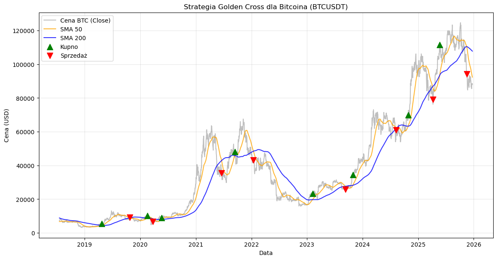

# Bitcoin SMA Backtester ₿

Profesjonalny skrypt analityczny w Pythonie służący do weryfikacji skuteczności strategii **Golden Cross / Death Cross** na historycznych danych Bitcoina.

## 🚀 O Projekcie

Celem projektu jest symulacja portfela inwestycyjnego opartego na klasycznej analizie technicznej. Skrypt pobiera dane bezpośrednio z giełdy Binance (bez kluczy API), przetwarza je i symuluje decyzje inwestycyjne.

### Zastosowana logika:
* **Kupno (Golden Cross):** Średnia 50-dniowa przecina 200-dniową od dołu. 
* **Sprzedaż (Death Cross):** Średnia 50-dniowa przecina 200-dniową od góry. 

## 📊 Wyniki i Funkcje

Skrypt generuje szczegółowy raport zawierający:
* ✅ Wykres cenowy z naniesionymi punktami wejścia (zielone ▲) i wyjścia (czerwone ▼).
* ✅ Obliczenie całkowitego zwrotu z inwestycji (ROI).
* ✅ Symulację kapitału początkowego (np. 10,000 USDT).
