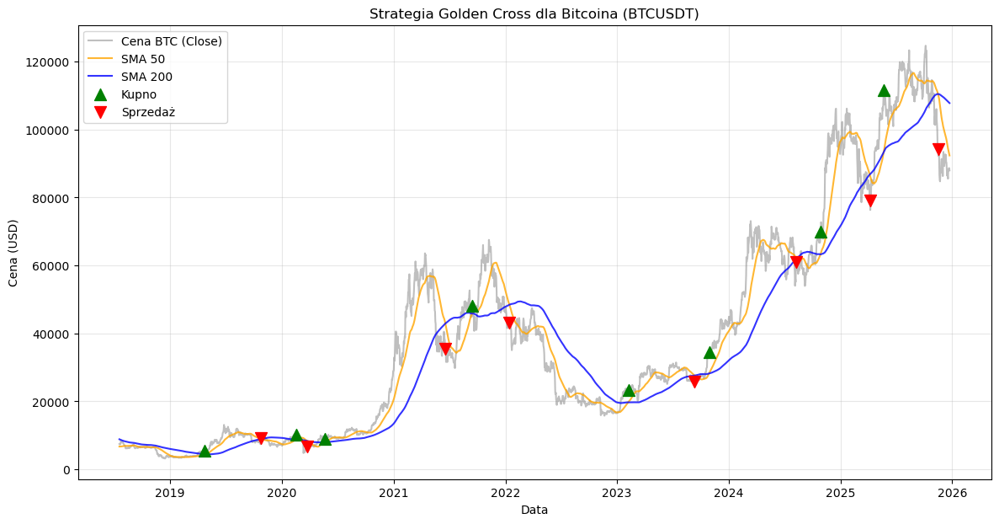

# Bitcoin SMA Backtester ₿

Professional analytical script in Python designed to verify the effectiveness of Golden Cross / Death Cross strategies using historical Bitcoin data.

## 🚀 About the Project: The goal is to simulate an investment portfolio based on classic technical analysis. The script retrieves data directly from the Binance exchange (no API keys required), processes it, and simulates investment decisions.

### Applied Logic:
* **Buy (Golden Cross): 50-day moving average crosses the 200-day moving average from below.
* **Sell (Death Cross): 50-day moving average crosses the 200-day moving average from above.
## 📊 Results & Features:

The script generates a detailed report including:
* ✅ Price chart with plotted entry (green ▲) and exit (red ▼) points.
* ✅ Calculation of total Return on Investment (ROI).
* ✅ Initial capital simulation (e.g., 10,000 USDT).
